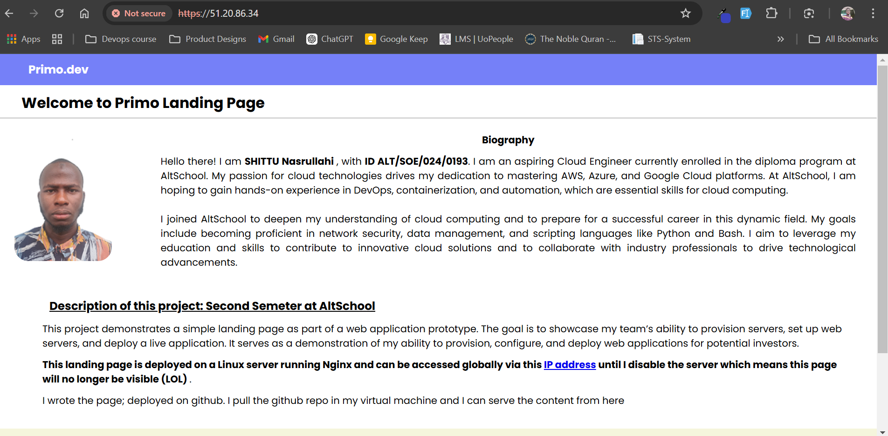

### HTML Landing Page Deployment on Nginx

This project demonstrates how to deploy a simple HTML landing page on a Linux server using Nginx and a self-signed SSL certificate for HTTPS connection. It is part of my AltSchool Africa second-semester Cloud Engineering exam.

---

## Project Overview

- **Project Title**: Welcome to Primo's Landing Page
- **Description**: 
  A basic landing page showcasing HTML and CSS skills. It includes:
  - My name
  - Project description
  - My full biography

- **Purpose**: Provision a Linux server, configure a web server (Nginx), and serve the landing page over HTTP and HTTPS.


## Deployment Steps

### 1. Provision the Server
- **Platform**: AWS EC2 (free tier)
- **OS**: Ubuntu 20.04
- **Setup Commands**:
  ```bash
  sudo apt update && sudo apt upgrade -y
  ```


### 2. Install Nginx
- Install Nginx:
  ```bash
  sudo apt install nginx -y
  ```

### 3. Created a github repo for the project and pushed my webfiles into the repo. I pulled the repo into my virtual machine


### 4. Generated an SSL (Self-Signed) for my ip address
- Generated a self-signed SSL certificate:
  ```bash
  sudo openssl req -x509 -nodes -days 365 -newkey rsa:2048 \
      -keyout /home/ubuntu/selfsigned.key \
      -out /home/ubuntu/selfsigned.crt
  ```


### 5. Configured Nginx to serve my directory instead of /var/www/ and also includes the SSL configuration into it. I also ensure to update the permissions on the folder
- Update the default Nginx configuration:
  ```nginx
  server {
      listen 80 default_server;
      listen [::]:80 default_server;

      return 301 https://$host$request_uri; # Redirect HTTP to HTTPS
  }

  server {
      listen 443 ssl default_server;
      listen [::]:443 ssl default_server;

      ssl_certificate /home/ubuntu/selfsigned.crt;
      ssl_certificate_key /home/ubuntu/selfsigned.key;

      root /home/ubuntu/webfile;
      index index.html;

      server_name _;

      location / {
          try_files $uri $uri/ =404;
      }
  }
  ```
- Test the configuration:
  ```bash
  sudo nginx -t
  sudo systemctl reload nginx
  ```


### 6. Configure Firewall
- Allow HTTP and HTTPS traffic:
  ```bash
  sudo ufw allow 'Nginx Full'
  sudo ufw enable
  ```

---

## Access the Landing Page

- **URL**: [https://51.20.86.34>](https://51.20.86.34)
- Note: You might encounter a browser warning due to the self-signed SSL certificate.

---





## Author

- **Name**: Nasrullahi SHITTU
- **Program**: AltSchool Africa Cloud Engineering, Second Semester
- **Contact**: nasrullahiolamide3011@gmail.com

---

### Acknowledgments

This project was completed as part of my coursework at AltSchool Africa, demonstrating server provisioning, web server configuration, and SSL setup.